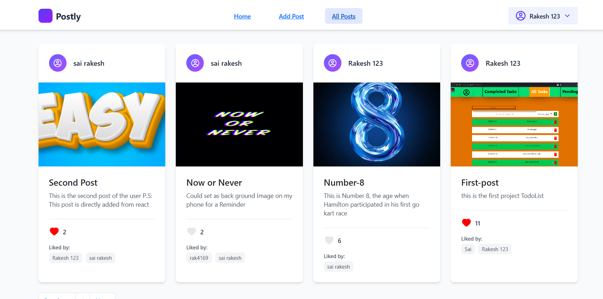

# Postly

Postly is a full-stack web application that enables users to create, share, and manage posts with secure authentication and image uploads. Built with a React frontend and Node.js/Express backend, it features modern UI, RESTful APIs, and cloud integration for a seamless user experience.

## Features
- User authentication and profile management
- Create, edit, and delete posts
- Image upload and cloud storage
- Email verification and notifications
- Responsive, modern UI with React

## Tech Stack
- Frontend: React, bootstrapcss, Tailwind CSS
- Backend: Node.js, Express, MongoDB
- Cloud: Cloudinary, MailTrap

## Screenshots

### Login Page

### Mail Verification

### Home Page
